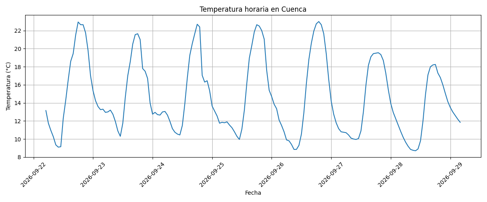
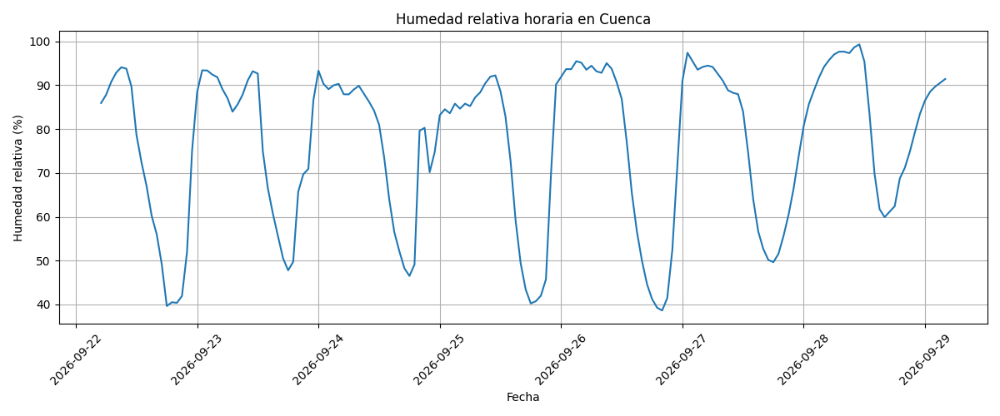
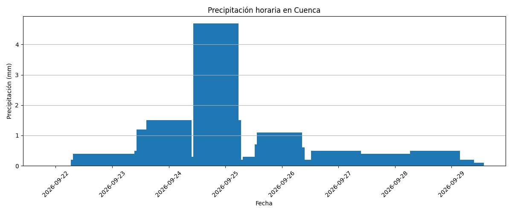
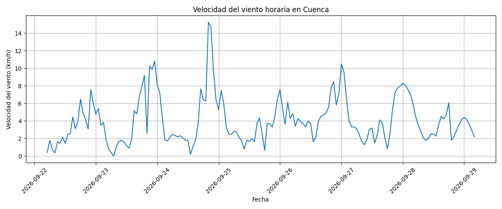
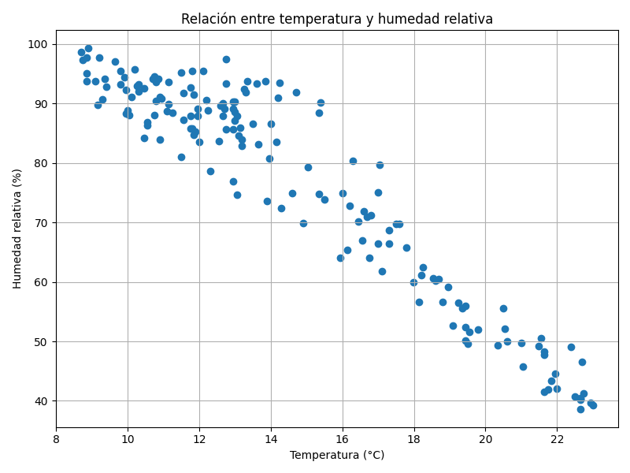

# Tarea 01 - Análisis de Datos Meteorológicos

## Maestría en Ciencia de Datos

### Objetivo

El objetivo de este trabajo es realizar la adquisición de datos meteorológicos utilizando la API de Open-Meteo, almacenar los datos obtenidos, visualizarlos mediante Matplotlib y responder preguntas relacionadas con su comportamiento.

## Fuente de datos

Los datos fueron obtenidos mediante la API gratuita de Open-Meteo:

https://open-meteo.com/

La ubicación seleccionada para el análisis fue Cuenca, Ecuador.

## Variables utilizadas

Se analizaron las siguientes variables meteorológicas:

- Temperatura a 2 metros (°C)
- Humedad relativa a 2 metros (%)
- Velocidad del viento a 10 metros (km/h)
- Precipitación (mm)

## Preguntas planteadas

1. ¿Cómo varía la temperatura en Cuenca durante los siete días analizados y cuáles son las temperaturas máxima y mínima?

2. ¿Cómo se comporta la precipitación durante el período analizado y cuál es la precipitación acumulada?

3. ¿Qué relación existe entre la temperatura y la humedad relativa durante el período analizado?

## Adquisición de datos

Los datos fueron obtenidos mediante Python utilizando la librería `openmeteo_requests`. Los resultados fueron procesados con Pandas y almacenados localmente en un archivo CSV.

El conjunto de datos contiene 168 observaciones horarias correspondientes a siete días.

## Visualización de datos

Se realizaron cinco gráficas utilizando Matplotlib:

1. Temperatura horaria.
2. Humedad relativa horaria.
3. Precipitación horaria.
4. Velocidad del viento horaria.
5. Relación entre temperatura y humedad relativa.
## Visualizaciones generadas

### Temperatura horaria

### Humedad relativa horaria

### Precipitación horaria

### Velocidad del viento horaria

### Relación entre temperatura y humedad

## Resultados

### Pregunta 1

Durante el período analizado, la temperatura máxima fue de 23,00 °C y la temperatura mínima fue de 8,70 °C. Esto representa una amplitud térmica de 14,30 °C.

### Pregunta 2

La precipitación acumulada durante los siete días fue de 33,70 mm. La mayor precipitación registrada en una hora fue de 4,70 mm.

### Pregunta 3

El coeficiente de correlación entre la temperatura y la humedad relativa fue de -0,951. Este resultado muestra una relación lineal negativa muy fuerte entre ambas variables. Durante el período analizado, al aumentar la temperatura, la humedad relativa tiende a disminuir.

## Herramientas utilizadas

- Python
- Pandas
- Matplotlib
- Open-Meteo API
- Google Colab
- GitHub

## Archivos del proyecto

- `Tarea_01_Meteorologia.ipynb`: código y análisis completo.
- `datos_clima_cuenca.csv`: datos obtenidos desde la API.
- `graficas/`: carpeta que contiene las cinco visualizaciones.
- `README.md`: documentación del proyecto.
